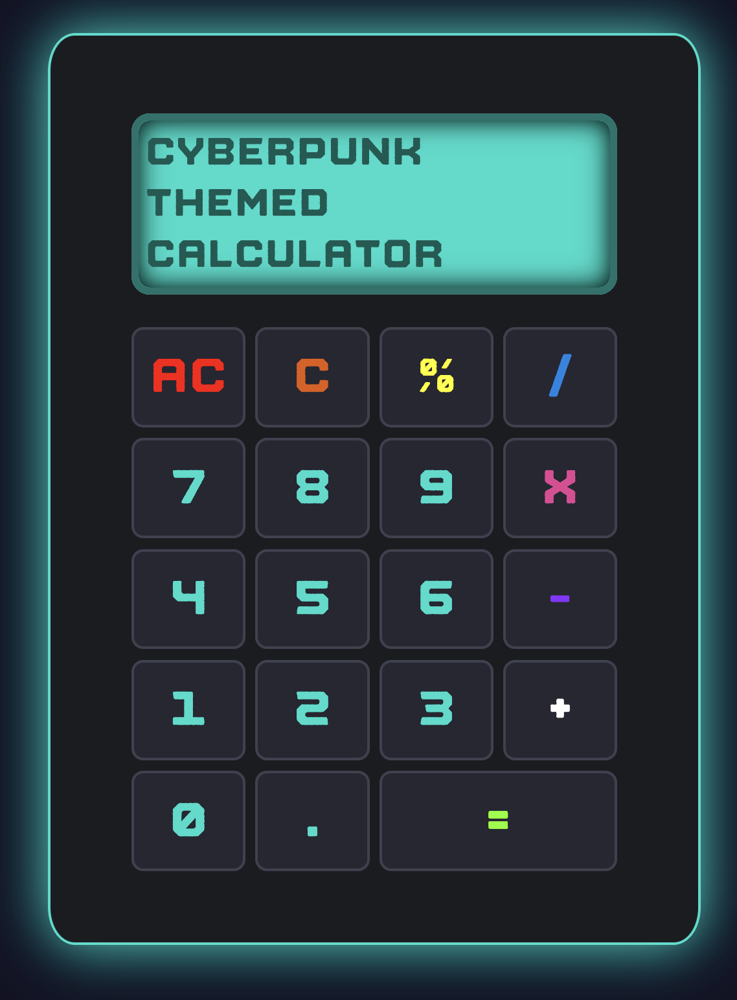

# Calculator in the browser

This is a calculator in the browser as a part of [The Odin Project](https://www.theodinproject.com). The logic is built according to The Odin Project's instruction so it might not behave as a regular calculator at all times. For more information, see the [project page](https://www.theodinproject.com/lessons/foundations-calculator).

The deployed version can be found [here](https://phoawb.github.io/Calculator/).
